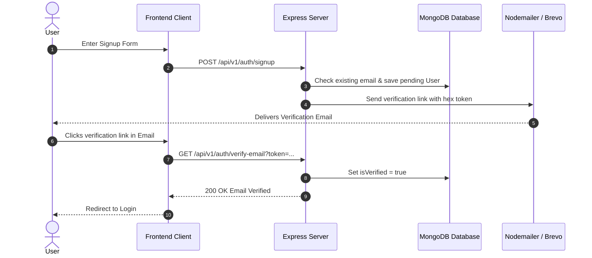
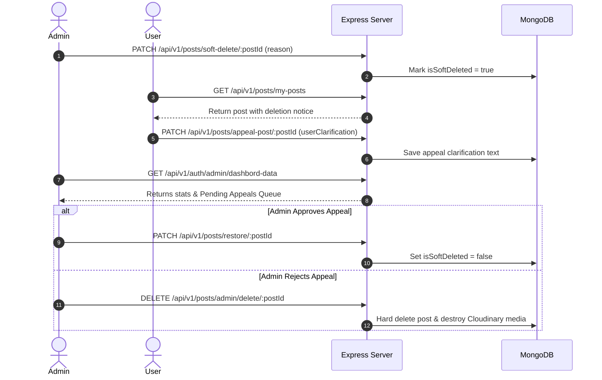

# 🛠️ Postify Backend — RESTful API Engine


> The core REST API server powering **Postify** — a social feed platform featuring JWT & Google OAuth 2.0 authentication, email token verification, media uploads, rate limiting, and an admin content moderation & appeal engine.

---

## 🌐 Live Server Endpoint

- **Production API Base URL**: `https://authentication-bakend-rclb.onrender.com/api/v1`
- **Health Check Endpoint**: `GET https://authentication-bakend-rclb.onrender.com/`

---

## 🏗️ System Architecture & Workflows

### 🔐 Authentication & Email Verification Sequence



---

### ⚖️ Admin Moderation & Appeal Workflow



---

## 📁 Repository Directory Layout

```
authBackend/
├── 📁 src/
│   ├── 📁 config/
│   │   ├── cloudnary.js            # Cloudinary SDK configuration
│   │   └── passport.js             # Google OAuth 2.0 Strategy initialization
│   ├── 📁 controllers/
│   │   ├── auth.controller.js      # Auth, Registration, Verification & Dashboard logic
│   │   └── post.controller.js      # Post CRUD, Interactions (Like/Comment/Share) & Moderation
│   ├── 📁 db/
│   │   └── index.js                # Async Mongoose MongoDB connection
│   ├── 📁 middlewares/
│   │   ├── auth.middleware.js      # JWT token verification & Admin role guard
│   │   ├── multer.middleware.js    # Disk storage setup for image uploads
│   │   └── ratelimit.middleware.js # Express rate limiters (e.g. 5 req/min on likes)
│   ├── 📁 models/
│   │   ├── user.model.js           # User schema (bcrypt password hashing, verification tokens)
│   │   └── post.model.js           # Post schema (likes array, comments, soft delete, appeals)
│   ├── 📁 routes/
│   │   ├── index.routes.js         # Central API router (`/api/v1`)
│   │   ├── auth.routes.js          # Authentication routes (`/api/v1/auth`)
│   │   └── post.routes.js          # Post routes (`/api/v1/posts`)
│   ├── 📁 utils/
│   │   ├── ApiError.js             # Custom Error class with status codes
│   │   ├── ApiResponse.js          # Unified API response payload wrapper
│   │   ├── asyncHandler.js         # Higher-order async wrapper
│   │   ├── cloudinaryService.js    # Media upload helper with auto temp cleanup
│   │   └── sendEmail.js            # Nodemailer transport for account verification
│   ├── app.js                      # Express configuration, CORS & Middleware chain
│   └── server.js                   # Application bootstrap entry point
├── .env.example                    # Environment variables template
├── .gitignore                      # Git exclusion rules
├── package.json                    # Project dependencies and scripts
└── pnpm-lock.yaml                  # pnpm lockfile
```

---

## ⚙️ Environment Configuration

Create a `.env` file in the `authBackend/` root directory using the template below:

```env
# Server Port & CORS
PORT=3000
FRONTEND_URL=http://localhost:5173

# Database & Authentication
MONGODB_URI=mongodb+srv://<username>:<password>@cluster.mongodb.net/authdb
JWT_SECRET=your_super_secret_jwt_key
JWT_EXPIRY=1d
ADMIN_SECRET=your_admin_secret_passcode

# Google OAuth 2.0 Setup
GOOGLE_CLIENT_ID=your_google_client_id.apps.googleusercontent.com
GOOGLE_CLIENT_SECRET=your_google_client_secret

# Nodemailer / Brevo SMTP
EMAIL_USER=your_email@domain.com
EMAIL_PASS=your_smtp_password
EMAIL_FROM=noreply@postify.com

# Cloudinary Storage SDK
CLOUDINARY_CLOUD_NAME=your_cloud_name
CLOUDINARY_API_KEY=your_api_key
CLOUDINARY_API_SECRET=your_api_secret
```

---

## 📡 API Endpoint Reference

### 1️⃣ Authentication Module — `/api/v1/auth`

| Method | Endpoint | Access | Body / Query | Description |
| :--- | :--- | :--- | :--- | :--- |
| `POST` | `/signup` | Public | `{ fullName, email, password }` | Registers user & dispatches verification email |
| `POST` | `/login` | Public | `{ email, password }` | Authenticates user & returns JWT token |
| `GET` | `/google` | Public | - | Initiates Google OAuth 2.0 login flow |
| `GET` | `/google/callback` | Public | - | Handles Google OAuth callback & redirects to frontend |
| `GET` | `/verify-email` | Public | Query: `?token=<token>` | Verifies user email token |
| `POST` | `/admin/signup` | Public | `{ fullName, email, password, adminSecret }` | Registers an Admin account |
| `GET` | `/admin/dashbord-data` | Admin | Headers: `Authorization: Bearer <token>` | Fetches stats, user list & pending appeals |

#### Example Response: `POST /api/v1/auth/login`
```json
{
  "statusCode": 200,
  "data": {
    "user": {
      "_id": "66a4f...",
      "fullName": "Jane Doe",
      "email": "jane@example.com",
      "role": "user",
      "isVerified": true
    },
    "token": "eyJhbGciOiJIUzI1Ni..."
  },
  "message": "login sucessfully",
  "success": true
}
```

---

### 2️⃣ Posts & Feed Module — `/api/v1/posts`

| Method | Endpoint | Access | Payload | Description |
| :--- | :--- | :--- | :--- | :--- |
| `GET` | `/feed` | Public | - | Retrieves all active public posts with populated user & comments |
| `POST` | `/create` | User | Form-Data: `content`, `image` *(optional)* | Creates a new post with Cloudinary image upload |
| `GET` | `/my-posts` | User | Headers: `Authorization: Bearer <token>` | Retrieves logged-in user's post history |
| `PATCH` | `/update/:postId` | User | Form-Data: `content`, `image`, `removeImage` | Updates post text content or replaces/deletes media |
| `DELETE` | `/delet/:postId` | User | - | Deletes user's own post and associated media |
| `PATCH` | `/like/:postId` | User | - *(Rate-limited: 5 req/min)* | Toggles like/unlike state using MongoDB aggregation |
| `PATCH` | `/comment/:postId` | User | `{ content }` | Adds a comment to a post |
| `PATCH` | `/share/:postId` | User | - | Increments post share counter |

---

### 3️⃣ Moderation & Admin Module — `/api/v1/posts`

| Method | Endpoint | Access | Payload | Description |
| :--- | :--- | :--- | :--- | :--- |
| `PATCH` | `/soft-delete/:postId` | Admin | `{ reason }` | Flags post as soft-deleted with custom removal reason |
| `PATCH` | `/appeal-post/:postId` | User | `{ userClarification }` | Submits clarification/appeal for soft-deleted post |
| `PATCH` | `/restore/:postId` | Admin | - | Clears soft-delete flag and restores post visibility |
| `DELETE` | `/admin/delete/:postId` | Admin | - | Permanently hard deletes post and destroys Cloudinary image |
| `GET` | `/admin/user-post/:userId` | Admin | - | Retrieves all posts for a specific user ID for review |

---

## Standardized Error Response Format

All API errors return a consistent JSON response structure powered by the `ApiError` utility:

```json
{
  "success": false,
  "statusCode": 403,
  "message": "Please verify your email first before logging in."
}
```

---

## 🚦 Getting Started & Local Development

> ⚡ **Package Manager**: This project uses **`pnpm`** for faster dependency installation, disk efficiency, and better performance.

```bash
# 1. Clone & navigate to backend directory
cd authBackend

# 2. Install dependencies using pnpm
pnpm install

# 3. Create .env file from template
cp .env.example .env

# 4. Run development server (Nodemon)
pnpm run dev

# 5. Production start
pnpm start
```

---

## 📄 License & Author

- **Author**: Aditya Singh
- **License**: MIT